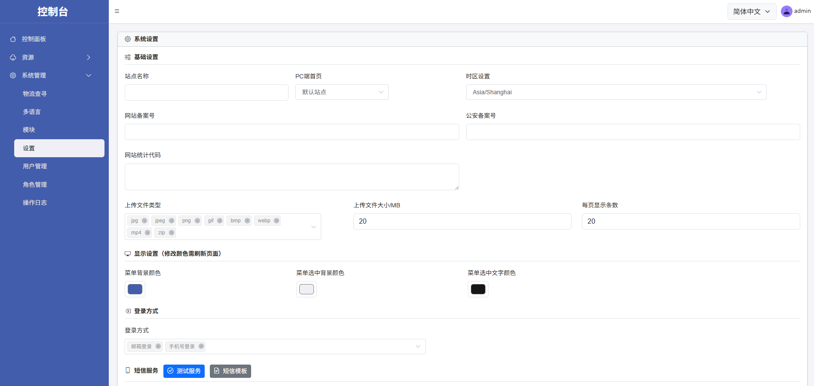
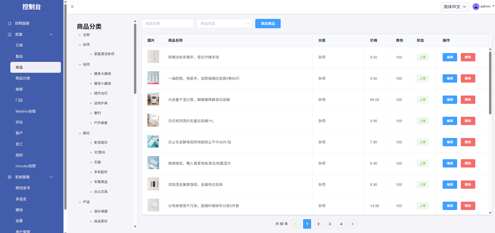
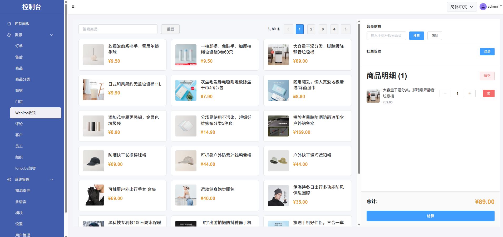
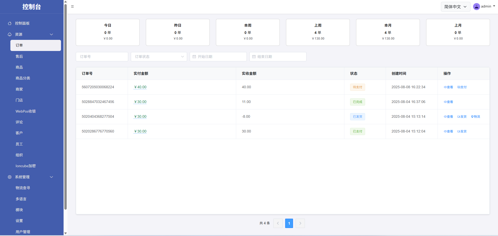

# nexophp

nexophp.netlify.app

- 安装

~~~
composer install  --ignore-platform-reqs
~~~

- 配置重写

WEB目录指向`public`

~~~
location / {
  if (!-e $request_filename){
    rewrite ^(.*)$ /index.php last;
  }
}
~~~

# 部分截图

依赖其他模块

 
# dev

~~~
composer update nexophp/* --ignore-platform-reqs -vvv
~~~

